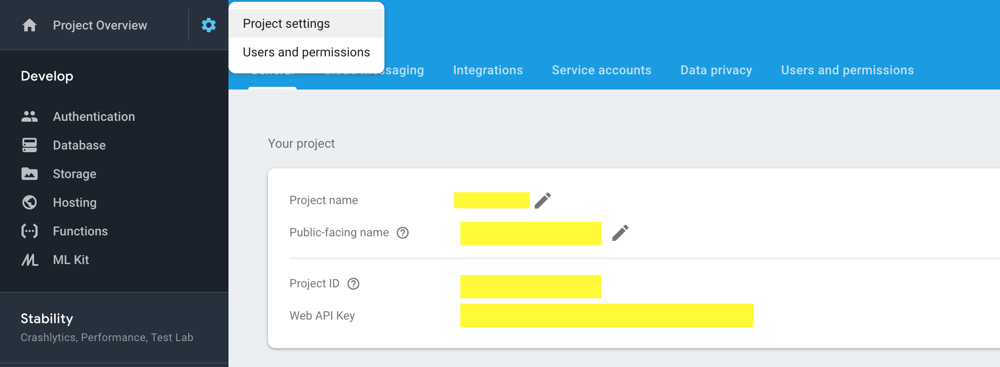

## Pre-Requirement

NPM (For windows - http://blog.teamtreehouse.com/install-node-js-npm-windows) 

Sublime or any other editor (https://www.sublimetext.com/3)

Download this project from github 

## Open Project in Sublime

Open Terminal and follow this instruction

```
cd path_to_downloaded_firebase-hosting-example_folder 
generally for mac it would be cd ~/Downloads/firebase-hosting-example
sublime .
```

## Setup Project in Firebase console

note down project id from project settings page 


* update .firebaserc default value to project-id and in firebase.json update firebase property value 


* put index.html file to public folder

```
npm install

npm run login

npm run deploy
```

## For Reference

* https://medium.com/@archana_june/firebase-custom-domain-setup-with-godaddy-8b7acf66ccec
